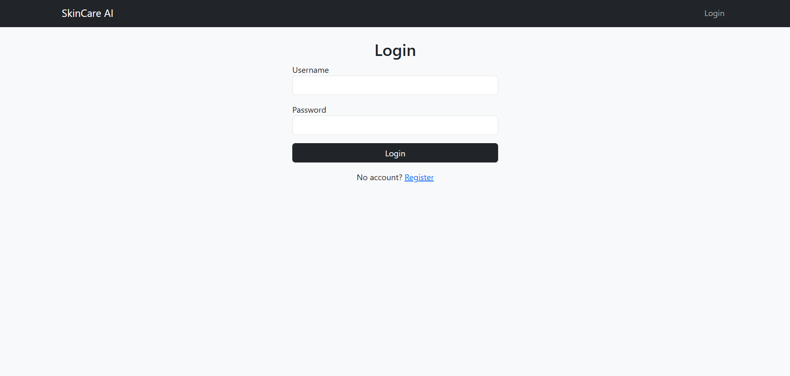
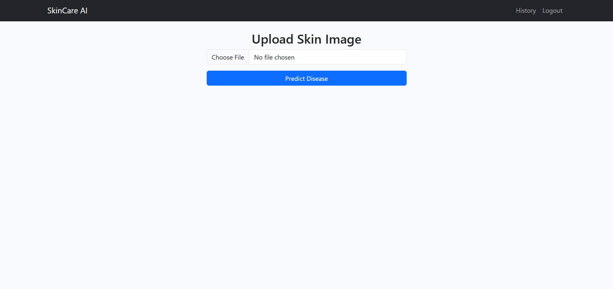
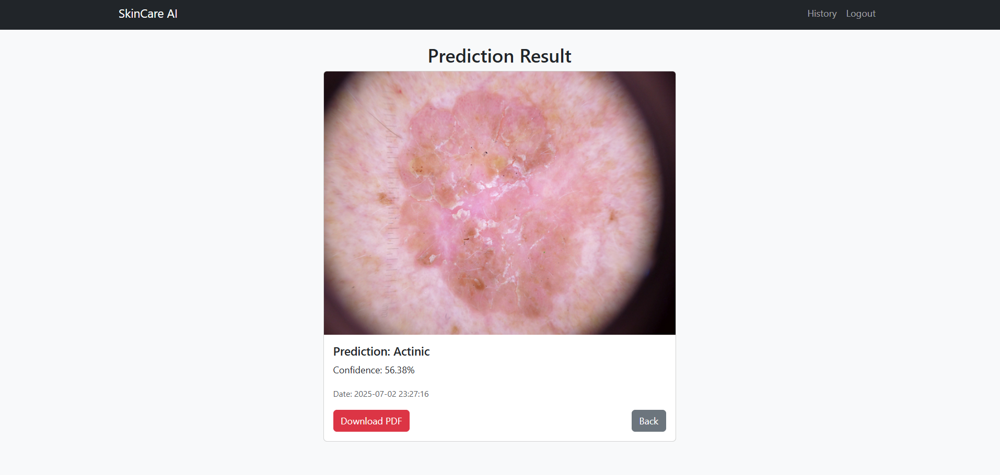
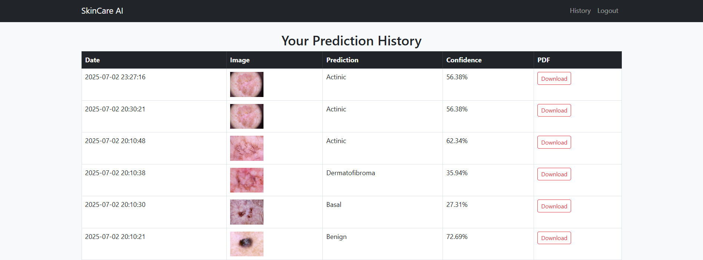

# 🧠 Skin Disease Classifier (Flask + CNN)

This is a web-based AI project built using Flask and TensorFlow. It allows users to upload skin images and predicts the type of skin disease using a trained CNN model. The app also includes user login, history tracking, PDF downloads, and a dashboard for stats.

---

## 🚀 Features
- Image-based skin disease prediction
- Confidence score shown with prediction
- User registration & login
- PDF download of prediction result
- History of predictions per user
- Admin dashboard with overall stats

---

## 🩺 Diseases Predicted
- Melanoma
- Basal Cell Carcinoma
- Actinic Keratoses
- Melanocytic Nevi
- Benign Keratosis-like Lesions
- Dermatofibroma
- Vascular Lesions

---

## 📁 Folder Structure
```
skin-classifier-project/
├── app.py
├── database.db
├── static/uploads/
├── templates/
│   ├── layout.html
│   ├── index.html
│   ├── login.html
│   ├── register.html
│   ├── result.html
│   ├── history.html
│   └── dashboard.html
├── train_model/
│   ├── preprocess_images.py
│   ├── split_dataset.py
│   ├── train_cnn_model.py
│   ├── skin_model.h5
│   └── class_names.txt
```

---

## 🧠 Train the Model
1. Prepare your images from the HAM10000 dataset.
2. Run preprocessing:
   ```
   python train_model/preprocess_images.py
   ```
3. Split dataset:
   ```
   python train_model/split_dataset.py
   ```
4. Train the CNN:
   ```
   python train_model/train_cnn_model.py
   ```

---

## 🛠 Run the Web App
1. Install dependencies:
   ```
   pip install -r requirements.txt
   ```
2. Start the server:
   ```
   python app.py
   ```
3. Open browser at:
   ```
   http://localhost:5000
   ```

---

## 🖼 Sample Screenshots

### 🔹 login Page


### 🔹 upload page


### 🔹 prediction results Page


### 🔹 history Page


---

## 📦 Dataset Used
[HAM10000 - Kaggle Skin Disease Images](https://www.kaggle.com/kmader/skin-cancer-mnist-ham10000)

---

## 📄 License
MIT License

---

Developed by **Anas** 
📧 Email: dawoodanas1221@gmail.com
